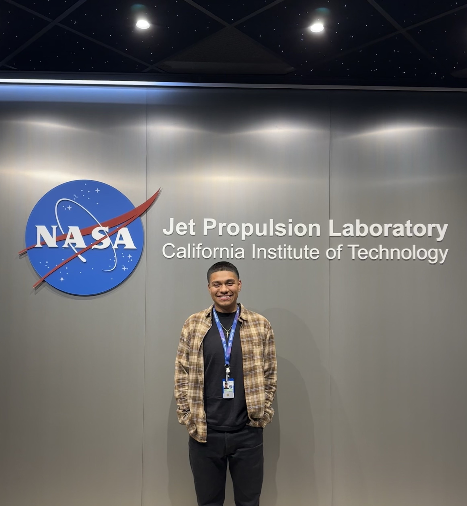

Hello and welcome! 

My name is Jesus Sanchez I have a Bachelor’s degree in Mechanical Engineering and am currently pursuing my Master of Science degree in Astronautical Engineering at the University of Southern California (USC). Throughout my academic and professional journey, I have had the opportunity to work at NASA Jet Propulsion Laboratory (JPL), drive research initiatives, and participate in various engineering competitions. I am excited to share my experiences and achievements which are highlighted on this website. 

For a quick overview, you can view my resume [here](JesusSanchez.pdf). If you would like to get in touch, you can find my contact information [here](contact.md). 

  

[Academics](academics.md)&nbsp;&nbsp;&nbsp;&nbsp;&nbsp;[Work Experience](workexp.md)&nbsp;&nbsp;&nbsp;&nbsp;&nbsp;[Research & Projects](projects.md)

  
  <h2><a href="academics.md">Academics</a></h2>
  
  <h2><a href="workexp.md">Work Experience</a></h2>
  
  <h2><a href="projects.md">Research & Projects</a></h2>
  

