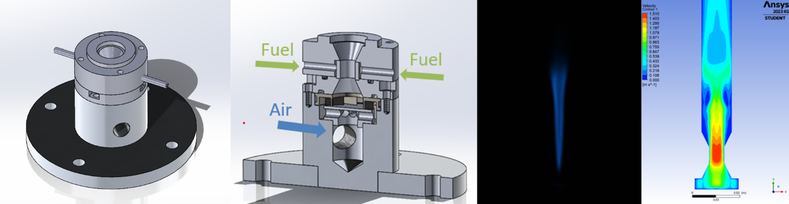
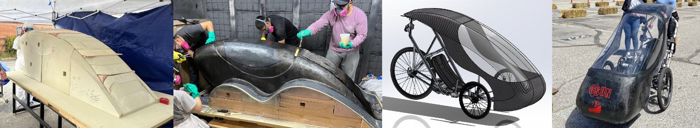
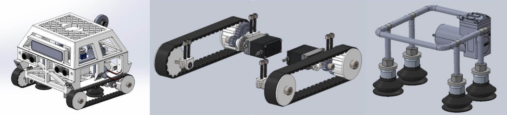

# Evaluation of Novel Scalable Swirl-Flame Hydrogen Combustor 
The use of hydrogen has attracted great interest due to its favorable combustion characteristics and increased concerns about the impact of hydrocarbon emissions on climate change. However, further research and development are needed before hydrogen can be widely adopted. This project investigates new hydrogen-air burner concepts suitable for stationary and aircraft gas turbine engines. The current burner design is capable of supporting up to 60% hydrogen dilution. Current work consists of developing a computational fluid dynamics (CFD) model to study the flow and combustion reaction. 

Technical skills: Ansys Fluent, MATLAB, LabVIEW, SOLIDWORKS, GD&T 

[Western State Section of the Combustion Institute (WSSCI) Conference Paper](ResearchPaper.pdf)

---

# ASME Human Powered Vehicle (HPV) 
As part of my senior design project, I joined CSUN’s Human Powered Vehicle team. Our team designed, tested, manufactured, and competed a human-powered vehicle. The team consisted of over 20 students divided into 5 subteams. I was part of the fairing subteam which was responsible for the design and fabrication of the fairing structure and attachment components. We competed with other universities and placed 2nd in design and 3rd in the speed race, resulting in 3rd overall placement. 

Technical skills: Ansys Fluent, SOLIDWORKS, SOLIDWORKS Simulations (FEA), hand calculations 

[Human Powered Vehicle (HPV) Report](HPVreport.pdf)

---

# NASA MINDS Autonomous Sensor Robot 
As participants in the NASA MINDS competition, our team proposed an autonomous robot designed to support the Artemis mission by conducting nondestructive testing (NDT) on spacecraft bodies. The robot was engineered to traverse 90-degree surfaces, allowing for internal inspection of composite materials, such as detecting delamination and disbanding. Competing against teams from over 25 colleges, we placed 3rd overall and earned 2nd place in the systems engineering report category.

Technical skills: SOLIDWORKS, SOLIDWORKS Simulations (FEA) 

[NASA MINDS Systems Engineering Report](NASAMINDS_2021.pdf)

  <a href="/index">Return Home</a>

