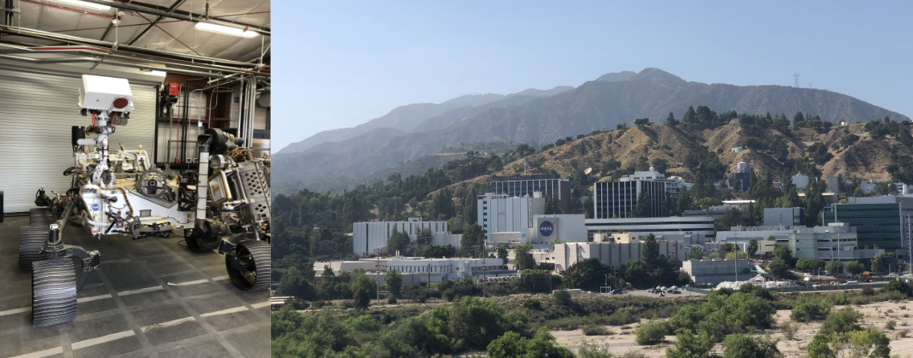

# Academic Part-Time Mechanical Engineer at NASA JPL
The [Jet Propulsion Laboratory (JPL)](https://www.jpl.nasa.gov/) is a leading NASA research center operating as a Federally Funded Research and Development Center (FFRDC). JPL is renowned for its cutting-edge work in space exploration, planetary science, and technology development, playing a crucial role in NASA’s most ambitious missions. 

I began my internship at JPL in May 2022 with the Electronic Packaging group where I played a key role in the [Mars Sample Return (MSR)](https://science.nasa.gov/mission/mars-sample-return/) mission. I began by working on ground support equipment (GSE) and developing a tool capable of assembling sensitive electromechanical hardware for the Earth Return Orbiter (ERO). Subsequently, I led the design of an electromechanical unit for the Sample Retrieval Lander (SRL). As a lead designer, I oversaw the development of the system from prototype to engineering and flight models. 

I was responsible for generating CAD models on Siemens NX and created engineering drawings with Geometric Dimensioning and Tolerancing (GD&T) such as detailed part drawings, assembly drawings, and interface-controlled drawings. I authored detailed written procedures and assembly instructions, ensuring smooth fabrication and successful system integration. Additionally, I collaborated with the production team to troubleshoot hardware build issues and enhance designs for manufacturability and assembly (DFM & DFA). 

Technical Skills: Siemens NX, Teamcenter, GD&T, tolerance analysis, hand calculations 

  <a href="/index">Return Home</a>

